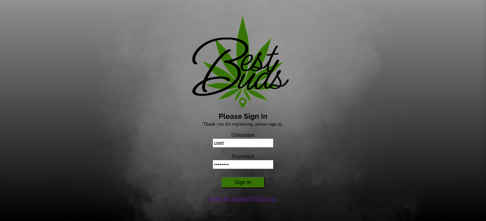
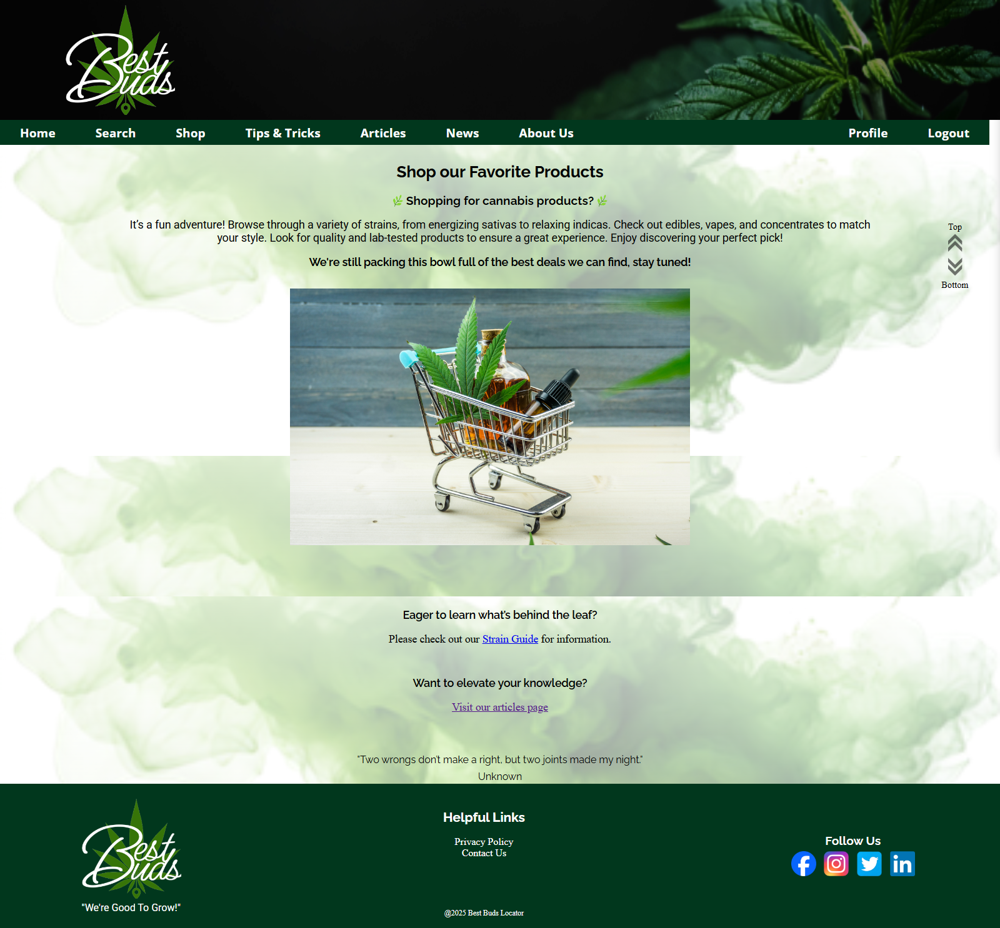
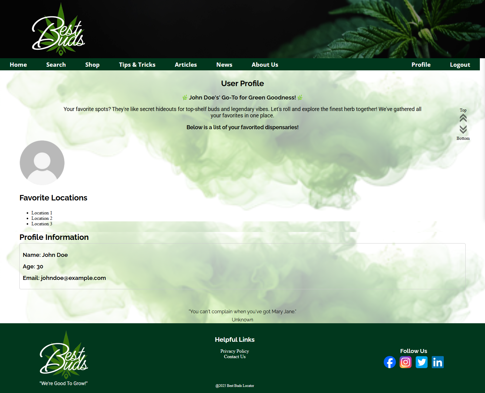
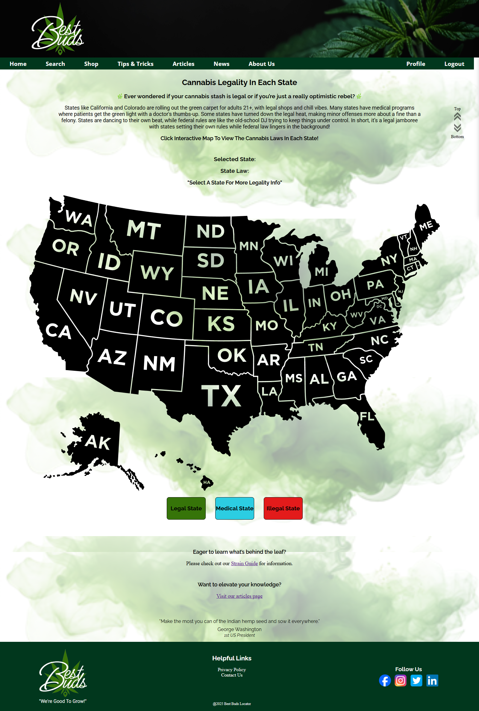
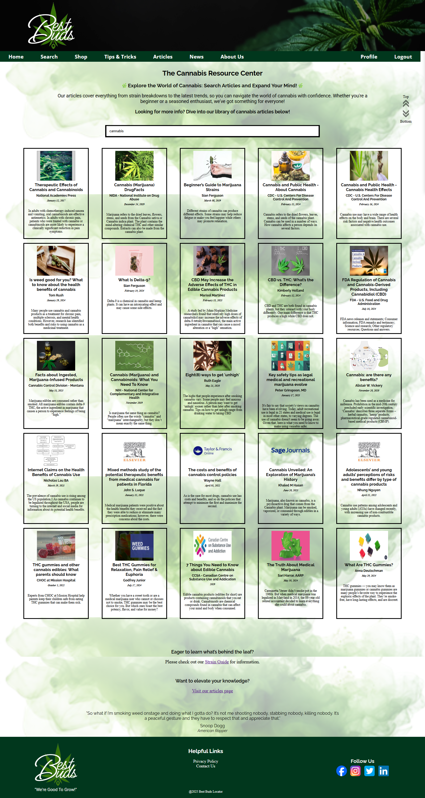
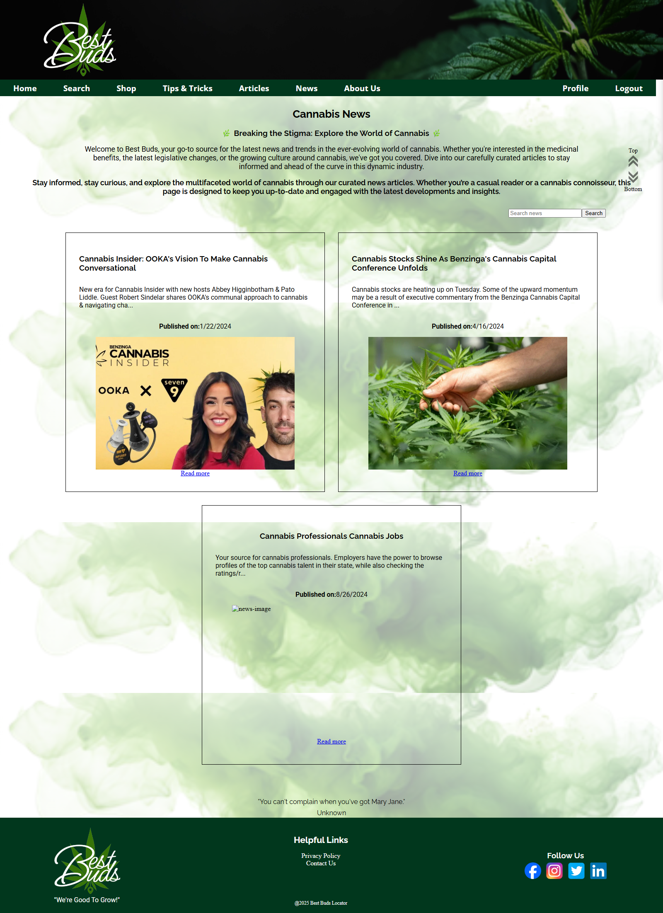
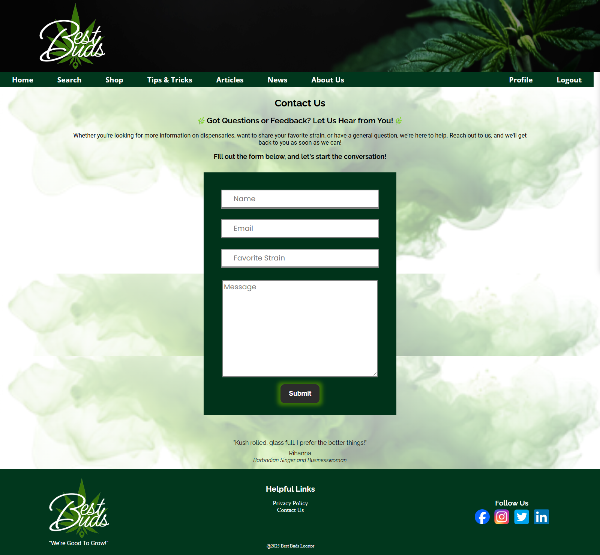

# Best Buds Dispensary Locator

### Full-Stack Business Discovery Application

Best Buds is a full-stack business discovery application that centralizes dispensary information, mapping services, industry news, and educational resources into a unified user experience.

The application demonstrates business systems analysis, API integration, relational database design, and full-stack web development by combining multiple external data sources with authenticated user features, personalized favorites, and structured workflows.

Originally developed as a collaborative project, the application was later redesigned and expanded to improve application architecture, user workflows, and overall functionality.

---

## Project Overview

Best Buds helps users discover and evaluate dispensaries by consolidating business information, mapping services, news content, and educational resources into a single application.

Users can:

- Search nearby dispensaries
- View business and location information
- Save favorite dispensaries
- Manage personalized user profiles
- Access educational content and industry news

All within a single, streamlined user experience.

---

## Key Features

### Business Discovery

- Search dispensaries using Yelp Fusion API data
- View business details and location information
- Browse nearby dispensaries through a centralized interface

### User Management

- Secure user authentication
- User profile management
- Personalized favorites functionality

### Information & Education

- View cannabis-related news from external sources
- Browse educational articles and informational resources
- Access state legality reference information

---

## System Architecture

### Frontend

- Vue.js
- JavaScript
- HTML5
- CSS3
- Axios

### Backend

- Java
- Spring Boot
- RESTful API
- JDBC

### Database

- PostgreSQL

### External Services

- Yelp Fusion API
- Google Maps API
- News API

---

## Technical Implementation

The application follows a traditional client-server architecture with a Vue.js frontend communicating with a Spring Boot REST API backed by PostgreSQL.

- Designed intuitive user interfaces supporting business discovery and information access
- Integrated Yelp Fusion, Google Maps, and News APIs into a unified user experience
- Implemented user authentication, profile management, and favorites functionality
- Implemented RESTful communication between frontend and backend systems
- Designed PostgreSQL database structures to support user and application workflows
- Applied full-stack development practices using Java, Spring Boot, Vue.js, and PostgreSQL

---

## Technology Stack

| Category | Technologies |
|-----------|-------------|
| Frontend | Vue.js, JavaScript, HTML5, CSS3, Axios |
| Backend | Java, Spring Boot, JDBC |
| Database | PostgreSQL |
| APIs | Yelp Fusion API, Google Maps API, News API |
| Tools | Git, GitHub, IntelliJ IDEA |

---

## Screenshots

The following screenshots demonstrate the primary user workflows throughout the application.

### Login

Secure user authentication for personalized features.

---

### Home Page

Introduces the application and primary navigation.

---

### Dispensary Search

Search nearby dispensaries using location-based business data.

---

### Dispensary Details

View business information, contact details, and available user actions.

---

### User Profile

Manage profile information and account settings.

---

### Tips & Tricks

Educational resources available within the application.

---

### State Legality Map

Interactive map displaying cannabis legality information by state.

---

### Educational Articles

Browse educational cannabis-related content.

---

### Industry News

Latest cannabis industry news aggregated through external APIs.

---

### Contact

Integrated contact form for user communication.

---

## Future Enhancements

- Responsive layout for tablets and mobile devices
- User reviews and ratings
- Enhanced search filtering
- Additional mapping functionality
- Personalized recommendations
- Expanded educational resources

---

## Author

**Jennifer Curtis**

Business Systems Analyst | Full-Stack Developer

🌐 **Portfolio:** https://jennifercurtis.me

💼 **LinkedIn:** https://linkedin.com/in/jcurtisdeveloper

💻 **GitHub:** https://github.com/craftycurtis05
